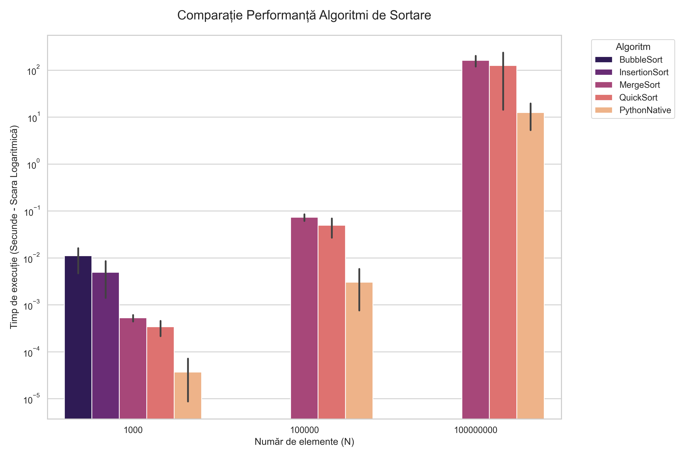

# 📊 Comparație Experimentală - Metode de Sortare

Proiect pentru disciplina **Algoritmi și Structuri de Date**. Analiza performanței algoritmilor de sortare pe diferite seturi de date și dimensiuni variabile.

## 💻 Specificații Sistem (Environment)
Rezultatele au fost obținute pe o configurație hardware de ultimă generație, facilitând testarea unor volume masive de date (până la 100M elemente):
- **Model:** MacBook Pro 14"
- **Procesor:** Apple M5
- **Memorie:** 16 GB RAM
- **Sistem de Operare:** macOS Tahoe 26.2

## 📁 Structura Proiectului
- `src/algoritmi.py`: Implementarea algoritmilor de sortare: Bubble Sort, Insertion Sort, Merge Sort și Quick Sort.
- `src/generator.py`: Script pentru generarea automată a seturilor de date în folderul `data/`.
- `main.py`: Scriptul principal care încarcă datele, rulează algoritmii și măsoară timpii de execuție.
- `visualize.py`: Script pentru generarea graficelor de performanță pe baza rezultatelor salvate.
- `rezultate.csv`: Tabelul cu datele brute obținute în urma experimentului.

## 📈 Rezultatele Experimentului
Iată o previzualizare a performanței măsurate pe MacBook Pro:


## 🚀 Ghid de utilizare
1. **Generarea datelor**:
   ```bash
   python3 src/generator.py